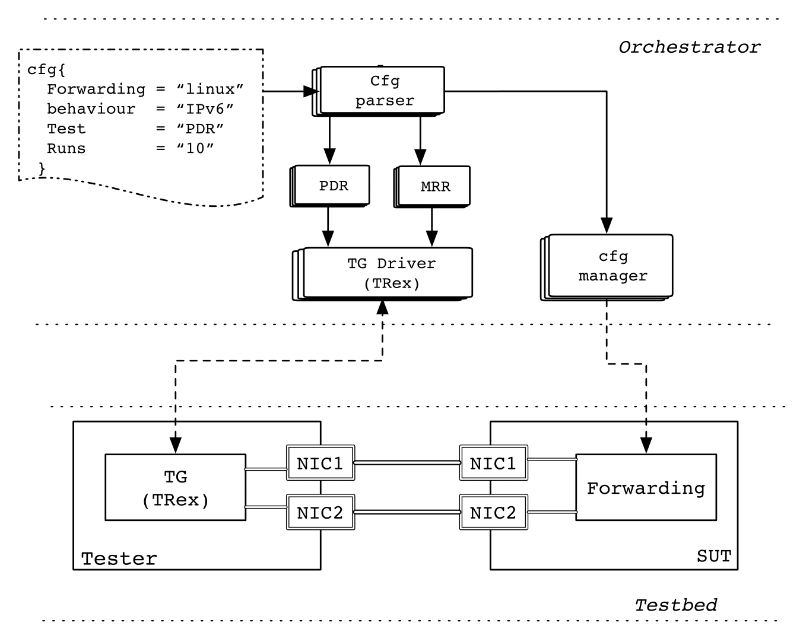

# SRPerf

SRPerf is a performance evaluation framework for software and hardware implementations of SRv6. It is designed following the network benchmarking guidelines defined in [RFC 2544](https://tools.ietf.org/html/rfc2544). 

## Architecture ##
The architecture of SRPerf is composed of two main building blocks: testbed and orchestrator as shown in the figure below. The testbed is composed of two nodes, the tester and the System Under Test (SUT).

The nodes have two network interfaces cards (NIC) each and are connected back-to-back using both NICs. The tester sends traffic towards the SUT through one port, which is then received back through the other port, after being forwarded by the SUT.

Accordingly, the tester can easily perform all different kinds of throughput measurements as well as round-trip delay. 

A full description of the framework can be found [here](http://netgroup.uniroma2.it/Stefano_Salsano/papers/18_srv6_perf_sr_sfc_workshop_2018.pdf). 



## Implementation ##

The implementation of SRPerf is orgainzed in several directories as follows: 
- **orchestrator:** contains the orchestrator implementation.
- **pcap:** contains the pcap files used by the tester to generate the traffic required to test the different SRv6 behaviors
- **sut:** contains the SUT node configuration scripts
- **tester:** contains the implementation of the tester

## Dependencies ##

Each of the differnt components of SRPerf requires a set of dependencies that needs to be installed in order to run successfully. 

Under each directory we can find the list dependencies in file named ***tools.list***

For example the orchestrator dependencies are:

```
paramiko (pip)
numpy (pip)
pyaml (pip)
```

## Traffic generation ##
SRPerf uses [TRex](https://trex-tgn.cisco.com/) as Traffic Generator (TG). TRex is an open source realistic traffic generator that supports both transmitting and receiving ports. It is based on DPDK and can generate layer-4 to layer-7 traffics with a rate up to 10-22 mpps per core.

## Config files ##

The config file should be in YAML format, and it can contain multiple YAML sequences. Each sequence represent a different test to be performed along with the parameters required for such test:

```
- experiment: ipv6
  rate: pdr
  run: 10
  size: min
  type: plain
```

We provide an automated way for generating such config file, using the ***config_generator.py*** availale under the ***orchestrator*** directory. 

```
Usage: config_generator.py [options]

Options:
       -h, --help            show this help message and exit
       -t TYPE, --type=TYPE  Test type {plain|transit|end|proxy|all}
       -s SIZE, --size=SIZE  Size type {max|min|all} 
```

## Orchestrator bootstrap ##

To start an experiment, some initial configurations have to be provided to the orchestrator. This configurations should be in the ***testbed.yaml*** under the ***orchestrator*** directory. 

The file should include the following configuration: 

- **sut:** IP address/hostname of your sut machine
- **sut_home:** absolute path where the sut scripts can be found 
- **sut_user:** username used for login in the sut machine
- **sut_name:** hostname of your sut machine
- **fwd:** forwarding engine to be used

An Example is as shown below: 

```
sut: 10.0.0.1
sut_home: /home/foobar/linux-srv6-perf/sut
sut_user: foo
sut_name: sut
fwd: linux
```

The ***cfg_manager*** assumes that the public key has been pushed in the sut node and the private key is stored inside the orchestrator folder as ***id_rsa***.
    
## Run an experiment ##

You can start an experiment by running the ***orchestrator.py*** script that can found under the orchestrator directory.
```
python orchestrator.py
```
